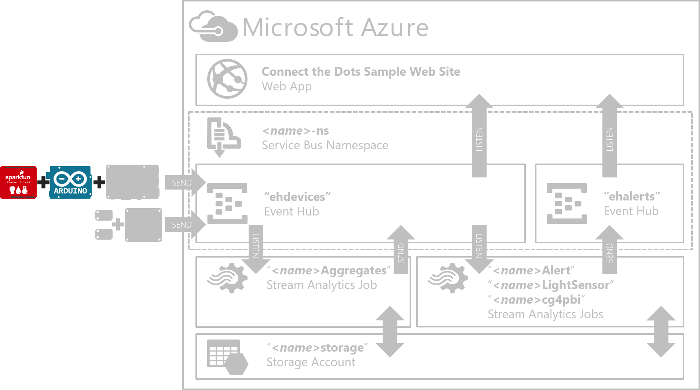

# "Arduino UNO With SparkFun Weathershield" Hands-On Lab #
---

## Overview ##

In this lab, we'll deploy code to an Arduino UNO that reads sensor data (Temperature, Humidity, and Light) from a SparkFun WeatherShield.  

The Arduino UNO is an extremely popular micro-controller platform. It has a fantastic community around it, and a staggering array of 3rd party components, actuators, sensors, and "shields" that work with it.  

However, when it comes to the "Internet of Things", the Arduino has some limitations

- It has relatively low processing power and memory.  
- It has not built-in communication capabilities other that Serial.   

The limitied processing power makes it difficult for it to participate in the secure protocols (AMQPS, HTTPS, SSL, etc) that enterprise grade IoT solutions require.

The limited communications means that we need to either add communication capabilities to it (like WiFi, Ethernet, Bluetooth, etc) , or better yet we could  connect it via a USB-to-Serial connection to a more powerful "gateway" device which handles the secure protocols and Internet communications. 

In this lab, we'll implement the code that allows the Arduino to read and package Sensor data, the publish it over a serial connection.  We'll then connected it to a Raspberry Pi "Gateway" via a USB-to-Serial connection and allow the Raspberry Pi to encrypt and transmit the messages to Azure.  We'll implement the Raspberry Pi Gateway Service in another lab.  
 
---

## Prerequisites ##

To successfully complete this lab, you will need: 

- An active Azure Subscription.  If needed you can create a [free trial here](http://azure.microsoft.com/en-us/pricing/free-trial "Azure Free Trial").

- A copy of the ConnectTheDots.io repository.  You can get the latest version [here](https://github.com/MSOpenTech/connectthedots/archive/master.zip "Connect the Dots Zip Download"). 

- An Arduino UNO and a USB Cable

- As SparkFun WeatherShield 

- The Arduino IDE (You can download and install for free from http://arduino.cc)

--

## Tasks ##

1. [Connect the Arduino UNO and SparkFun WeatherShield to your computer](#Task1)
1. [Deploy and Test the WeatherShieldJson.ino Sketch](#Task2)
1. [Connect the Aduino UNO and SparkFun WeatherShield to the Raspberry Pi](#Task3)

---

<a name="Task1" />
## Task 1 - Connect the Arduino UNO and SparkFun WeatherShield to your computer ##

In this task, we'll connect the SparkFun WeatherShield to the Arduino UNO, then connect the Arduino UNO via USB to your computer.  

---

<a name="Task2" />
## Task 2 - Deploy and Test the WeatherShieldJson.ino Sketch ##

---

<a name="Task3" />
## Task 3 - Connect the Aduino UNO and SparkFun WeatherShield to the Raspberry Pi ##

---

