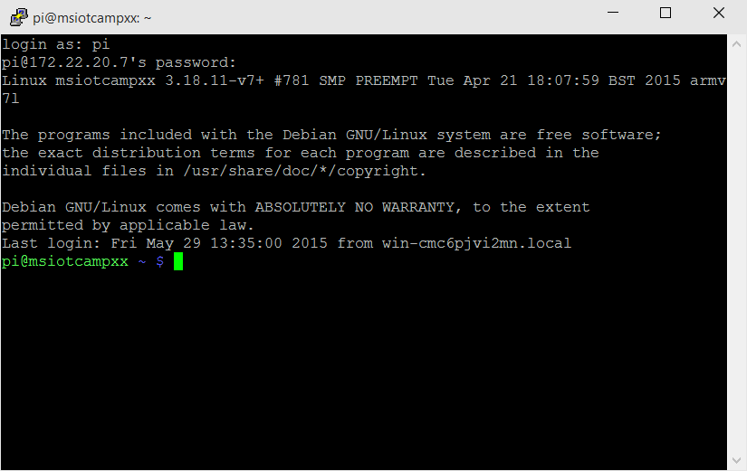
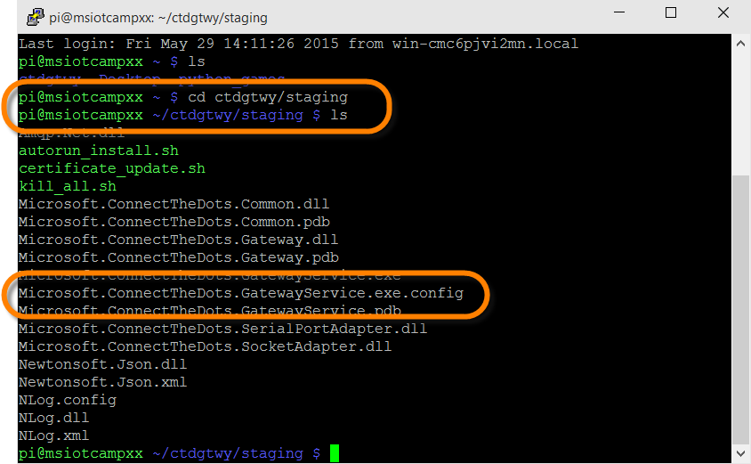
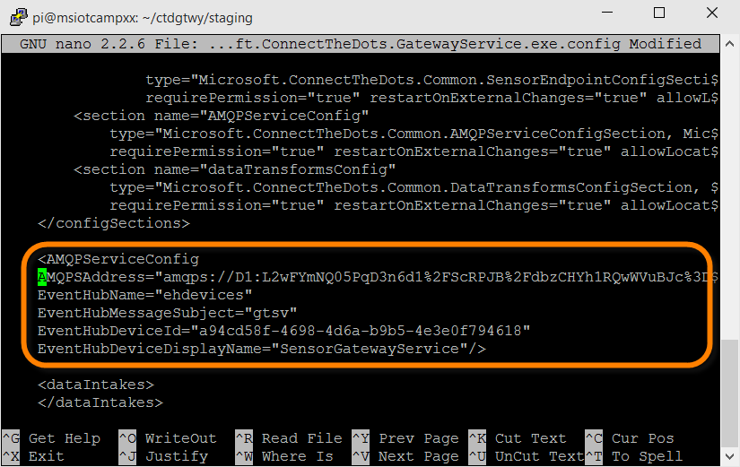
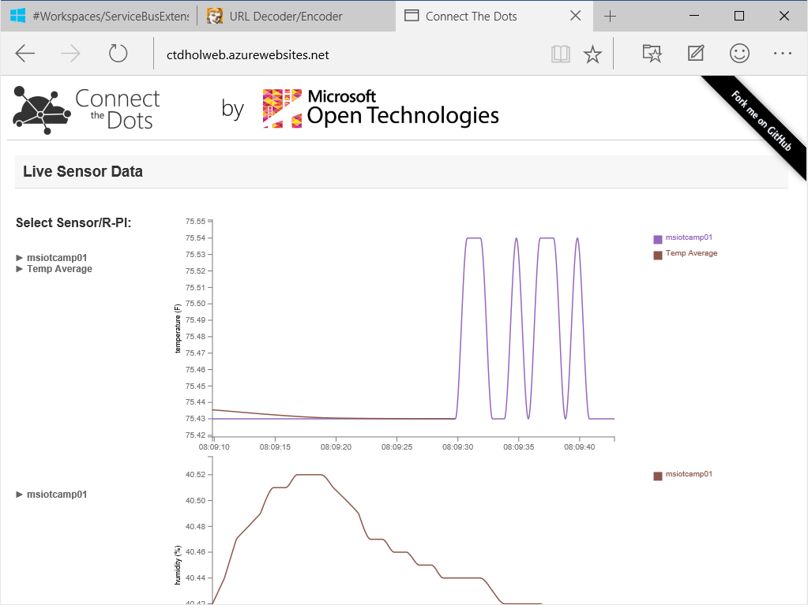

# "Raspberry Pi Field Gateway" Hands-On Lab #

---

## Overview ##

In this lab, you will configure your Raspberry Pi 2 as a "Field Gateway".


A "Field Gateway" is a common solution for securing and transmitting data from lower powered microcontrollers, or those without direct network connectivity.   


In our scenario, we have the Arduino Uno with the SparkFun Weather Shield that we implemented in a previous lab.  The Arduino Uno is an awesome platform, but it does have a few real limitations:  

- Limited processing power and memory.  This makes it hard to communicate using secure protocols like HTTPS, or AMQPS where more intensive processing is required.   
- No built in remote communication capabilties.  You need to extend the Arduino with additional components for Ethernet, WiFi, Bluetooth, etc.  

Our solution here then is to connect the Arduino to our Raspberry Pi using a USB-to-Serial connection.  The Raspberry Pi can then receive the sensor data messages from the Arduino Uno over the serial connection, and then forward them on securely using HTTPS, or AMQPS over Ethernet or WiFi. 

---

## Alternative, More Hands-On Walkthrough ##

This Hands-On Lab is a simplified, and more streamlined version of the original Raspberry Pi gateway setup documentation.  In this lab, we assume you are at an event where a pre-configured Raspberry Pi image has already been applied to the SD Card in your Raspberry Pi.  

This pre-configured image already has

- Raspian operating system installed (via NOOBS)
- Mono
- WiFi Configuration
- The GatewayService .NET project already deployed

All you really need to do in this lab is:

- Remote into your Raspberry Pi via ssh or remote desktop
- Modify the GatewayService application configuration file with the path and keys to your "ehdevices" event hub
- Plug in your Arduino with SparkFun Weather Shield
- Sit back and watch the data flow! 

If you are at an event where the pre-configured image is available you may want to start with this lab, then if you have time and want to get more hands on with the Pi setup, you can wipe out the SD card and start over, following the documentation in the [Original Raspberry Pi Gateway Setup Docs](/Devices/Gateways/GatewayService/RaspberryPi-Gateway-setup.md)

---

## Prerequisites ##

To successfully complete this lab, you will need: 

- An active Azure Subscription.  If needed you can create a [free trial here](http://azure.microsoft.com/en-us/pricing/free-trial "Azure Free Trial").

- A copy of the ConnectTheDots.io repository.  You can get the latest version [here](https://github.com/MSOpenTech/connectthedots/archive/master.zip "Connect the Dots Zip Download"). 

- An ssh client (like [PuTTY](http://www.chiark.greenend.org.uk/~sgtatham/putty/download.html "PuTTY Downloads") on Windows)
  
- A Raspberry Pi 2 with a USB WiFi adapter

- A copy of the Raspberry Pi image on an SD Card with the Gateway Service code pre-deployed.  If you prefer to configure and deploy the GatewayService yourself, you can refer to the [Original Raspberry Pi Gateway Setup Documentation](/Devices/Gateways/GatewayService/RaspberryPi-Gateway-setup.md)

- Previous completion of the ["Azure Prep" Hands-On Lab](/HOLs/Azure/AzurePrep/README.md) 

- Previous Completion of the ["Arduino Uno With SparkFun Weather Shield" Hands-On Lab](/HOLs/Devices/GatewayConnectedDevices/Arduino UNO/Weather/WeatherSheildJson/README.md)

- Knowledge of your Raspberry Pi's IP address.

--

## Tasks ##

1. [Boot your Raspberry Pi off the Pre-Configured Image](#Task1)
1. [Modify the Gateway Config](#Task2)
1. [Connect the Arduino Uno](#Task3)
1. [Task 4](#Task4)
1. [Task 5](#Task5)

---

<a name="Task1" />
## Task 1 - Boot your Raspberry Pi off the Pre-Configured Image ##

1. Ensure that the SD Card with the pre-configured image is installed in the Raspberry Pi 
2. Ensure that the USB WiFi Adapter is connected to a USB port (or if you are using a direct wired ethernet cable, that the ethernet cable is plugged in) 
3. Connect your Arduino Uno with the SparkFun Weather Shield attached to a USB port on the Raspberry Pi.
4. Finally connect the power supply to the Raspberry Pi
5. The following should image should show you your approximate configuration

	> **Note:** If you don't have the Arduino ready yet, that's ok.  You can plug it in later.  

	

6. Work with your event staff to determine the Raspberry Pi's IP Address
7. Use an ssh client (You can use [PuTTY](http://www.chiark.greenend.org.uk/~sgtatham/putty/download.html "PuTTY Downloads") on Windows) or a Remote Desktop Client (mstsc.exe on Windows) to connect to the IP Address of your Raspberry Pi and login with the credentials:

	- Login:	**pi**
	- Password:	**raspberry**

	

	  

8.  The SD Card is configured with the "Raspbian" linux distribution, so the commands that you enter will be linux commands.  Start by getting a listing of your home folder by typing `ls` and pressing enter.  Notice the "**ctdgtwy**" folder name:

	`ls`

	

9.  The "**ctdgtwy** is the folder that contains the "**GatewayService**" deployment.  The "**GatewayService**" is actually a .NET application that is being run on the Raspberry Pi using the [Mono](http://www.mono-project.com/) open source .NET implementation.  If you are interesting in seeing that source code, and how it was deployed, refer to the [Original Raspberry Pi Gateway Setup Docs](/Devices/Gateways/GatewayService/RaspberryPi-Gateway-setup.md).  Here, well just assume it is deployed correctly.  

9.  Change into the ctdgtwy/staging folder (ctdgtwy is short for "**C**onnect **t**he **D**ots **G**a**t**e**w**a**y**"), do another `ls` command and notice the (very long named) "**Microsoft.ConnectTheDots.GatewayService.exe.config**" (whew!) file.  

	`cd ctdgtwy/staging`

	

10.  We need to edit the contents of that file.  There are numerous text editors available on linux, and if you have on you prefer, feel free to use it.  We will use a simple one called "**Nano**".  Enter the command:

	`nano Microsoft.ConnectTheDots.GatewayService.exe.config` 

	

11. Use the arrow keys on your keyboard to move down through the file and locate the section that reads:

	```xml
	<AMQPServiceConfig
	AMQPSAddress="amqps://[key-name]:[key]@[namespace].servicebus.windows.net"
	EventHubName="ehdevices"
	EventHubMessageSubject="gtsv"
	EventHubDeviceId="a94cd58f-4698-4d6a-b9b5-4e3e0f794618"
	EventHubDeviceDisplayName="SensorGatewayService"/>
	```

12. Notice the missing [key-name], [key], and [namespace] placeholders.  We need to enter those so that the Raspberry Pi can successfully connect to the "ehdevices" event hub we created previously.  
13. Leave your ssh window open, and back on your computer open the browser, login to the [Azure Management Portal](https://manage.windowsazure.com) (https://manage.windowsazure.com).  
14. Navigate the portal to find your "**ehdevices**" event hub, and on the "**CONFIGURE**" page,  and get the "**PRIMARY ACCESS KEY** for your "**D1**" "**Shared Access Policy**".  

	

15. Before you can use the key though, we need to URL encode it.  Go to http://meyerweb.com/eric/tools/dencoder/ to use their URL Encoder / Decoder tool.  Paste they key you just copied in, then hit the "**Encode**" button, then copy the encoded to the clipboard.  

	

	

15.  Back in your ssh, and nano, use the arrow keys and your key and keyboard to edit the string.  Replace the place holders with the values from your Service Bus Namespace & Event Hub:

	| Place Holder | Value                                                | 
    | ---          | ---                                                  |
    | [key-name]   |  "**D1**" (no quotes)                                |
    | [key]        |  The URL encoded version of the key you just copied.  Note that many ssh clients (like PuTTY) will paste whatever is in your clipboard if you right click.  So you can delete the place-holder with the keyboard, get the cursor in the right place, then right click to paste the encoded version of the key you copied to the clipboard previously  |
    | [namespace]  |  The service bus namespace you created earlier, "**ctdhol-ns**" in this case |

	 

16.  Finally, to save your changes in Nano, press "**Ctrl-X**" (Exit), the "**Y**" to save the changes, and then "**ENTER** to confirm the original file name.  And as long as you didn't make any typos, you should be good to go. 

17.  To reboot your Raspberry PI, "**DON'T JUST UNPLUG IT!.  SHUT IT DOWN NICELY!!!**".  in your ssh window, run the following command to shut reboot it.  If you are using PuTTY you'll see an error about being disconnected, of course that is to be expected:

	`sudo reboot`

	

18. When the Raspberry Pi starts back up, you should now be able to go to your website and see sensor values coming in! 

	


